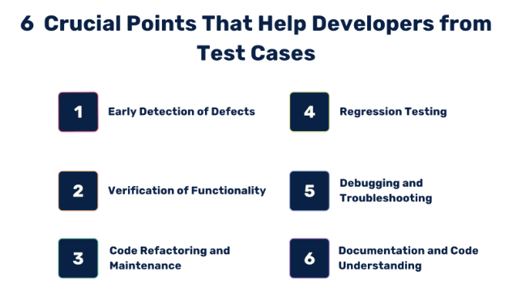

# Implement Unit Testing in an Existing Working Project

In this task, I have implemented unit testing in an existing working project. The project is a Django project that has a REST API built using Django Rest Framework. The project is already working and has some endpoints that are functional. I have written unit tests for the existing endpoints to ensure that they work as expected and to catch any bugs that may arise in the future.

## Table of Contents

1. [Project Overview](#project-overview)
2. [Setting Up the Test Environment](#setting-up-the-test-environment)
3. [Writing Unit Tests](#writing-unit-tests)
4. [Running the Tests](#running-the-tests)
5. [Pipeline Integration](#pipeline-integration)
6. [Conclusion](#conclusion)
7. [References](#references)

## Project Overview

The project, is a Django project that has a REST API built using Django Rest Framework, name is "[Echowater](https://github.com/OutCode-Software/EchoWater-Backend)". It has several endpoints that perform CRUD operations on various models. The project uses PostgreSQL with multi schema support as the database and has a Docker setup for local development.

Why Unit Testing?

- **Identify Bugs Early**: Unit tests help in identifying bugs early in the development process. By writing tests for the existing endpoints, we can ensure that they work as expected and catch any issues before they reach production.

- **Ensure Code Quality**: Unit tests help in ensuring code quality by testing individual components of the codebase. This helps in maintaining the quality of the code and makes it easier to refactor or add new features.

- **Improve Code Coverage**: Unit tests help in improving code coverage by testing different scenarios and edge cases. This ensures that the codebase is well-tested and robust.

- **Reduce Regression Issues**: Unit tests help in reducing regression issues by ensuring that new changes do not break existing functionality. By running tests before deploying new code, we can catch any issues early and fix them before they reach production.



## Setting Up the Test Environment

This is the example of how to set up the test environment for the project:

1. **Clone the Repository**:
    ```bash
    git clone https://your-repo-url.git
    cd your-project-directory
    ```
2. **Install Dependencies**:
    ```bash
    pip install -r requirements.txt
    ```
3. **Environment Configuration**:
    ```bash
    cp .env.example .env
    ```
4. **Run Initial Migrations**:
    ```bash
    python manage.py migrate
    ```
5. **Running Test**:
    ```bash
    python manage.py test
    ```
6. **Running Specific Test**:
    ```bash
    python manage.py test your_app.tests.test_your_test
    ```

## Writing Unit Tests

To write unit tests for the existing endpoints, follow these steps:

1. **Create a Test Directory**:
    Ensure that each app has a `tests` directory. Inside this directory, you will write your test cases.

2. **Write Test Cases**:

    - Create a new Python file inside the `tests` directory for each test case.
    - Import the necessary modules for testing.

    - The basic example of a test case is as follows:
        ```python
        from django_tenants.test.cases import TenantTestCase
        from django_tenants.test.client import TenantClient

        class BaseSetup(TenantTestCase):

            def setUp(self):
                super().setUp()
                self.c = TenantClient(self.tenant)

            def test_user_profile_view(self):
                response = self.c.get(reverse('user_profile'))
                self.assertEqual(response.status_code, 200)
        ```
    - In the above example, we are testing the `user_profile` endpoint to ensure that it returns a status code of 200.

3. **Run the Tests**:
    Run the tests using the following command:
    ```bash
    python manage.py test
    ```
    This will run all the test cases in the project.

## Running the Tests

To run the tests, use the following command:
```bash
python manage.py test
```

This will run all the test cases in the project and display the results in the console.

## Pipeline Integration

To integrate the unit tests into the CI/CD pipeline, you can add a step in your pipeline configuration file to run the tests. For example, if you are using GitLab CI/CD, you can add the following step to your `.gitlab-ci.yml` file:

```yaml
test:
  stage: test
  script:
    - python manage.py test
```

Or, in github actions, you can add the following step to your `.github/workflows/main.yml` file:

```yaml
name: CI

on: [push]

jobs:
  test:
    runs-on: ubuntu-latest

    steps:
    - uses: actions/checkout@v2

    - name: Set up Python
      uses: actions/setup-python@v2
      with:
        python-version: '3.x'

    - name: Install dependencies
      run: |
        python -m pip install --upgrade pip
        pip install -r requirements.txt

    - name: Run tests
      run: |
        python manage.py test
```

This will run the tests as part of the pipeline and fail the pipeline if any of the tests fail.
For further information, you can refer to the [GitHub Actions Documentation](https://docs.github.com/en/actions) or the [GitLab CI/CD Documentation](https://docs.gitlab.com/ee/ci/).
The simple documentation has been made here, you can customize it according to your project requirements. [Link here](0201_cicd_pipeline.md)

## Conclusion

In this task, I implemented unit testing in an existing working project. I wrote test cases for the existing endpoints to ensure that they work as expected and to catch any bugs that may arise in the future. Unit testing is an essential part of software development as it helps in identifying issues early in the development process and ensures that the code works as expected.

## References

- [Django Testing Documentation](https://docs.djangoproject.com/en/4.0/topics/testing/)
- [Django Rest Framework Testing Documentation](https://www.django-rest-framework.org/api-guide/testing/)
- [Python Unit Testing Documentation](https://docs.python.org/3/library/unittest.html)
- [Django Tenant Schemas Testing Documentation](https://django-tenants.readthedocs.io/en/latest/test.html)
- [Django Tenant Test](https://django-tenants.readthedocs.io/en/latest/test.html#)
